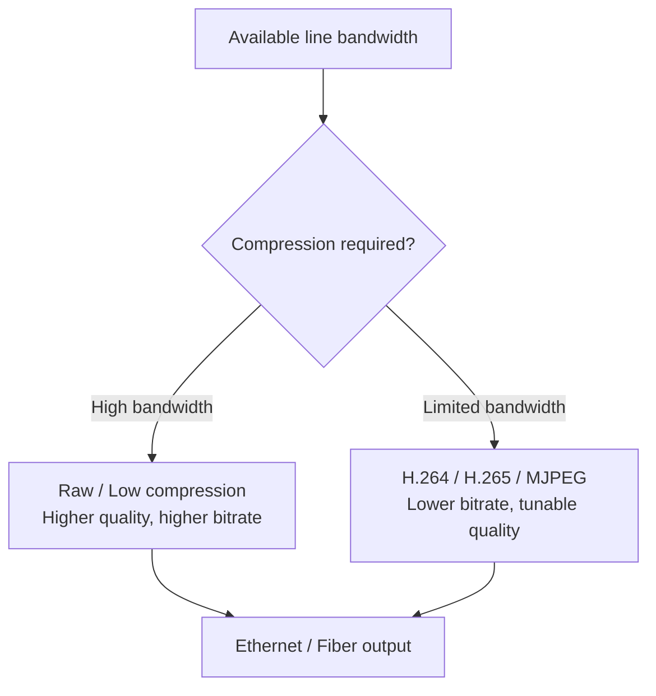
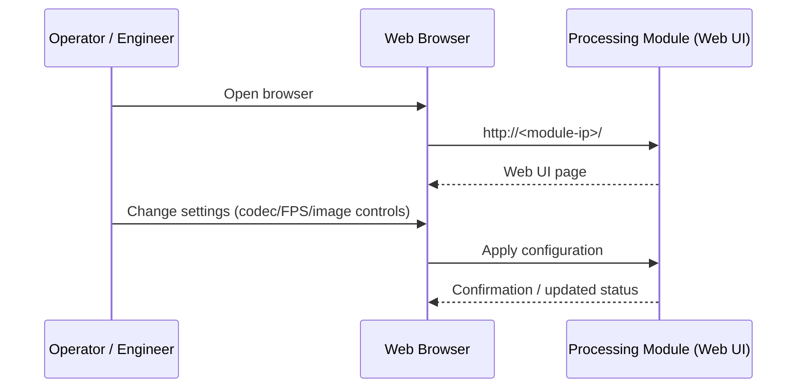

# Camera System

The **ZIMO Camera System** is a modular subsea imaging platform designed for **low latency**, **high frame rate**, and **flexible integration**. The system is split into two main parts:

- **Subsea Camera Module** (SerDes camera)
- **Camera Processing Module** (multi-port SerDes receiver + encoding + streaming)

Both modules can be delivered as complete assemblies or as integration-ready hardware, depending on your system architecture.

---

## System Overview

At a high level, the camera transmits video over a **SerDes link** to the processing module. The processing module can then stream video topside via **Ethernet or fiber**, using compression levels that match the available link bandwidth.

```mermaid
flowchart LR
  CAM[Subsea Camera Module\n(SerDes, 4K Global Shutter)] -->|SerDes link| PROC[Camera Processing Module\n(4 or 8 SerDes ports)]
  PROC -->|Ethernet| NET[Topside / Network / Recorder]
  PROC -->|Fiber| FIB[Fiber Link]
  NET --> VIEW[Operator UI / VMS / Applications]
  FIB --> VIEW
```

### Bandwidth and compression

Your **available line bandwidth** determines how much compression is required. Higher bandwidth allows lower compression (higher quality), while constrained links require more aggressive compression.



---

## Subsea Camera Module

A compact SerDes camera designed for subsea use with robust materials and minimal startup/latency overhead.

### Highlights

- **Sensor:** IMX-based, **global shutter**
- **Video:** up to **4K @ 120 FPS**
- **Field of view:** ~**100°**
- **Boot time:** **< 50 ms**
- **System latency:** **< 40 ms** *(configuration dependent)*
- **Materials:** **Sapphire** (optical window) + **316L** (structure)
- **Interface:** **SerDes** video link
- **Form factor:** extremely compact
- **Connector:** can be delivered with a specified connector option *(project dependent)*

### Notes

- Final performance depends on configuration (resolution, frame rate, output format, encoder settings, and line bandwidth).
- Mechanical envelope, connector options, and pinouts will be documented as they are finalized.

---

## Camera Processing Module

A high-performance embedded processing unit with **4 or 8 SerDes ports**, designed to receive one or multiple SerDes cameras and stream video with configurable encoding and image controls.

### Variants

- **4-port SerDes input**
- **8-port SerDes input**

### Capabilities

- **Output formats:**
  - **H.264**
  - **H.265**
  - **MJPEG**
  - **Raw** *(bandwidth permitting)*
- **Frame rate control:** configurable to match application needs and bandwidth constraints
- **Image controls (examples):**
  - shutter / exposure
  - brightness
  - contrast
  - and other common camera controls *(feature set may vary by camera profile)*
- **Streaming output:** **Ethernet or fiber** *(deployment dependent)*

### Configuration (Web UI)

All settings are managed through a built-in web interface:

1. Connect to the processing module on the network  
2. Open a web browser  
3. Enter the module **IP address**  
4. Adjust camera and stream settings



### Integration and constraints

- Available as:
  - **Standalone unit with housing**
  - **Bare PCB** for integration into a customer system
- **Not oil-fillable** (do not plan for oil compensation)
- **Power:** up to **130 W** *(variant and workload dependent)*

> **Thermal note:** Design for adequate thermal management at the system level (conduction path, heatsinking, or equivalent cooling strategy).

---

## Downloads (placeholders)

These items will be added as they become available:

- Datasheet (PDF): *Coming soon*
- STEP models (3D): *Coming soon*
- Technical diagrams: *Coming soon*
- Firmware / releases: *Coming soon*
- Connector options + pinouts: *Coming soon*

### Suggested file locations (recommended)

- `downloads/camera-system/datasheet.pdf`
- `downloads/camera-system/step/`
- `downloads/camera-system/diagrams/`
- `downloads/camera-system/firmware/`
- `downloads/camera-system/pinout/`

---

## Components (coming soon)

- Control System: *Coming soon*
- Camera: *Coming soon*

