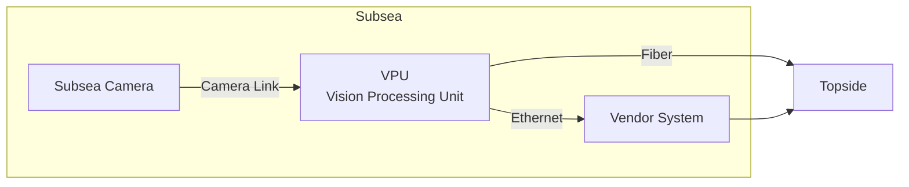

# Subsea Camera

A rugged, low-latency subsea camera module designed for simple integration: **one coaxial cable** from camera to **VPU (Vision Processing Unit)**.

---

## At a glance

| Item | Specification |
|---|---|
| Pressure rating | **600 bar** |
| Field of view | **100°** |
| Focus | **Fixed** |
| Housing material | **316L stainless steel** |
| Optical port | **Sapphire** |
| Camera link | **Single coax camera link** (video + control over one coax) |
| Connector | **Glenair 707-0264-7ME1-Z1SN** |
| Max coax cable length | **Up to 15 m (typical)** *(depends on cable selection and installation)* |
| Glass-to-glass latency | **< 40 ms** |

---

## Connectivity

---

## Mechanical

- **Pressure class:** 600 bar  
- **Materials:** 316L housing + sapphire optical port  
- **Mounting / envelope / drawings:** *coming soon*  
- **Sealing concept & test procedure:** *coming soon*  

---

## Optics

- **FOV:** 100°  
- **Focus:** Fixed  
- **Port-induced distortion:** minor (introduced primarily by the optical port)  
  - **Preliminary placeholder:** ~**1–3% radial distortion** at the image edge  
  - Calibration profile: *coming soon*

---

## Imaging (high level)

- **Effective resolution:** **2064 × 1552 (~3.2 MP)**  
- **Max sensor readout:** up to **125 fps** *(mode-dependent; configuration-dependent)*  
- **Bit depth / HDR / low-light / spectral response:** *coming soon*  
- **Image examples & characterization plots:** *coming soon*  

---

## Electrical & interface

- **Single coax link:** video + control on one coax (no separate control wiring)  
- **Pinout / power input / polarity / protections:** *coming soon*  
- **Power consumption & heat dissipation:** very low (negligible housing heat rise in typical use)  
  - Verified numbers: *coming soon*

---

## Thermal

- Passive heat path via **metal housing → seawater**
- No active cooling required under typical operating conditions
- Thermal limits & validation: *coming soon*

---

## Environmental & robustness

Designed for long-term subsea operation with emphasis on:
- Corrosion-resistant construction (316L + sapphire)
- Robust single-cable architecture (fewer penetrations, fewer connectors)
- Shock/vibration suitability for ROV operations: *coming soon* (test plan & results)

---

## Reliability & operation

- **Single coax** simplifies installation and reduces failure points
- Link health monitoring / fault behavior / recovery behavior: *coming soon*
- Recommended installation practices:
  - Strain relief at camera and VPU ends
  - Maintain appropriate bend radius
  - Avoid abrasion points and sharp edges

---

## Safety

- Electrical safety features (ESD/overvoltage/overcurrent, brown-out behavior): *coming soon*
- Fail-safe behavior on link loss / power interruption: *coming soon*
- Handling & pressure-safety notes: *coming soon*

---

## Compliance

Documentation and compliance roadmap: *coming soon*  
(Planned focus areas: EMC, product safety, RoHS/REACH where applicable.)

---

## Related pages

- Software control & tuning: see **VPU** page (*coming soon*)
- System integration guide: see **VPU** page (*coming soon*)
